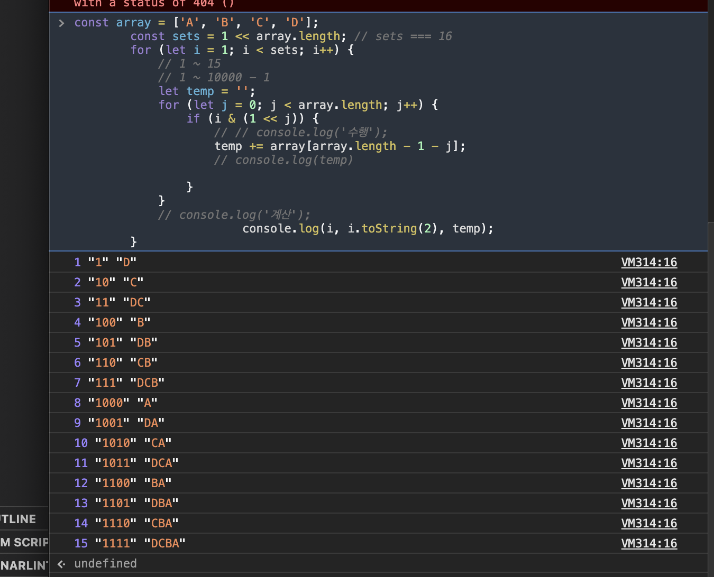

# javascript로 알고리즘 구현

> javascript로 구현하고 싶은 것들은 이곳에 정리.
> 

## 조합
n개의 요소중 중복없는 모든 개수의 조합   

모든 조합을 한 번씩 만들 수 있는 조합을 만들 때에는 비트연산을 활용하면 좋다.   
이진수 치환시 특정 수의 n번째 인덱스가 무슨 수인지 알 수 있는 식을 이용하여 해결할 수 있다.    
-->>>>> ( n & (1 << idx) )
```javascript
    const array = ['A', 'B', 'C', 'D'];
    const sets = 1 << array.length; // sets === 16 // array 의 길이만큼 이진수 자리를 세팅하고 검사한다고 생각
    for (let i = 1; i < sets; i++) {
        let temp = '';
        for (let j = 0; j < array.length; j++) {
            if (i & (1 << j)) { // i의 j번째 인덱스가 0이 아닐 때!
                temp += array[array.length - 1 - j];
            }
        }
		console.log(i, i.toString(2), temp);
    }
```

콘솔에 출력해본 결과물.


처음에는 이해하기 어려웠었지만 이해하고 나니 비트 연산을 이렇게 활용할 수 있구나~
깨달아서 좋았다 😄

## next permutation - 01 ( 다음 순열 )

출처 : https://stackoverflow.com/questions/9960908/permutations-in-javascript/37580979#37580979   
이미 정해진 숫자에 대해 고정시키고 그 다음 순열에 대하여 찾기.   
아래의 식은 next permutation을 이용해 모든 순열을 구하는 식.   

```javascript

const permutator = (inputArr) => {
  let result = [];

  const permute = (arr, m = []) => {
    if (arr.length === 0) {
      result.push(m)
    } else {
      for (let i = 0; i < arr.length; i++) {
        let curr = arr.slice();
        let next = curr.splice(i, 1);
        permute(curr.slice(), m.concat(next))
     }
   }
 }

 permute(inputArr)

 return result;
}
```

## next permutation - 02 

이건 내가 만든 것...   
공부했던 알고리즘을 그대로 구현하려 했고 다음 순열을 구하는 식이다. 
```javascript
function next_permutation(a){
  let i = a.length-1;
  while(i > 0 && a[i-1] >= a[i]) {
      i -= 1
  };
  if(i<=0) return false; // 마지막 순열 판단하기
  let j = a.length-1;
  while(a[j] <= a[i-1]) j -= 1;
  // === swap;
  a[j] = [a[i - 1], a[i-1] = a[j]][0];
    j = a.length - 1
    while(i < j){
      a[j] = [a[i], a[i] = a[j]][0]
        i+=1; j-=1;
    }
    // console.log(arr)
    return true
}
```
