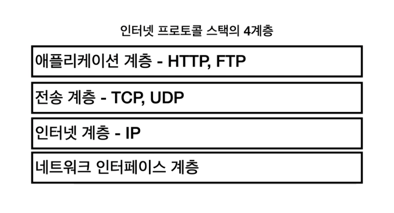
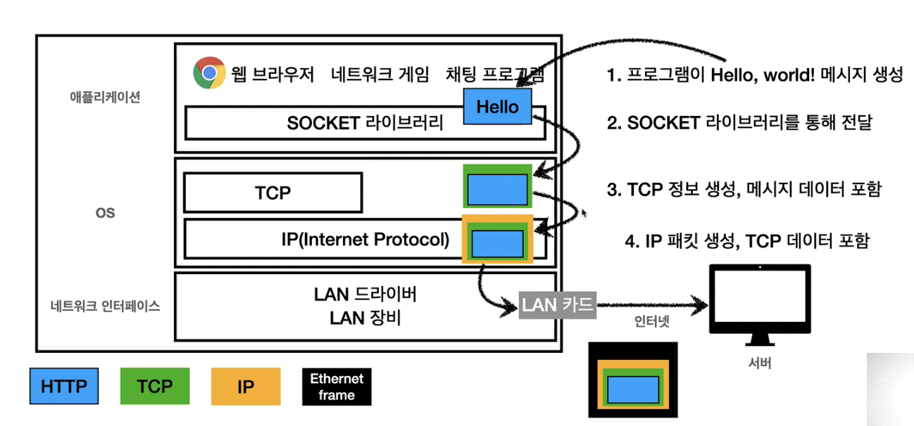
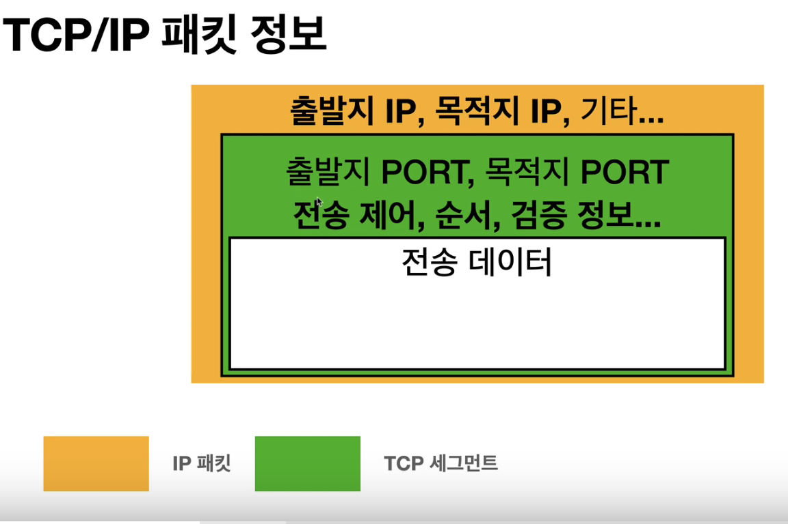
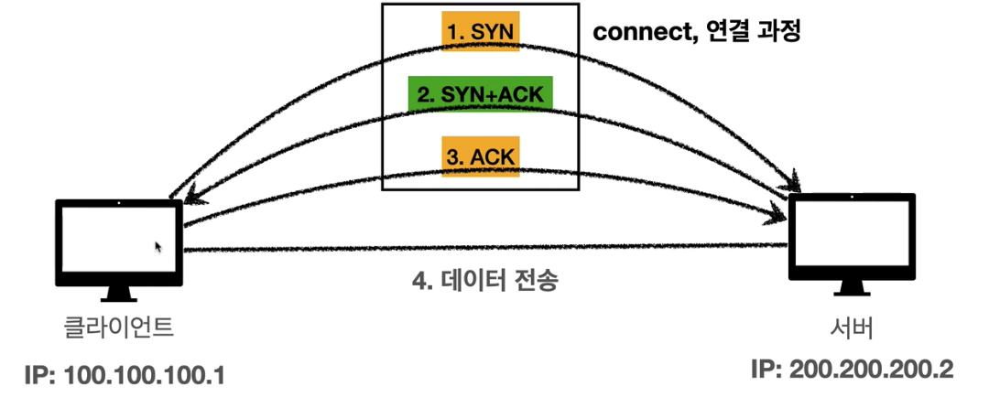

# IP, TCP, UDP

## IP

>인터넷 프로토콜 역할

지정한 IP주소에 데이터 전달하게 됨      
IP패킷이라는 규칙이 있다.       
전송데이터를 출발지 IP, 도착지 IP를 적어 IP패킷을 만들어서 인터넷망에  던짐. 그럼 인터넷 망 내부에서 노드들이 도착지 주소를 보고 서로 이 패킷을 주고 받으면서 목적지까지 도착할 수 있도록 해준다.       
 IP패킷을 주고 받는 것 만으로는 어느정도 한계가 있다.      

## IP프로토콜의 한계

- 비연결성      
패킷을 받을 대상이 없거나 서비스 불능 상태여도 패킷 전송(PC가 꺼져있을 수도 있으니)      

- 비신뢰성      
중간에 패킷이 사라지면?      
패킷이 순서대로 안오면? 너무 많은 바이트 (1500바이트가 거의 대부분 한계) 일 경우 쪼개서 보내는 경우도 잇음. 근데 패킷들이 중간에 다른 노드를 탈 수도 있다. 최종적으로 순서가 다르게 도착할 수 있음.      

- 프로그램 구분      
같은 IP를 사용하는 서버에서 통신하는 애플리케이션이 둘이상이면?      

→ 이런 문제를 해결 해 주는 것이 TCP, UDP      

## 인터넷 프로토콜 스택의 4계층      

      

간단하게 우리가 사용하는 컴퓨터로 생각해보자.       

만약에 hello라는 메세지를 전달하고자 함. 그러면 이걸 TCP 정보로 감싼다.       

그리고 TCP 밑 IP계층으로 가게 되고, IP패킷을 생성해준다. IP와 관련된 정보가 생성됨      

그리고 랜카드로 나갈때 이더넷 프레임을 통해 나가게 된다 (물리적인 정보가 포함됨)      

## IP 패킷 정보

IP패킷이 뭘까?      
수하물을 뜻하는 패킷, 버킷이 합쳐짐.       
TCP에는 출발지, 목적지 포트, 전송제어, 순서, 검증 정보들이 들어가기 때문이 이전의 IP만으로 해결되지 않았던 문제들이 해결이 되게 된다.       

## TCP?

**전송제어프로토콜**

- 연결지향 ,연결이 되었는지 확인을 하고 전송한다..      
***TCP 3 way handshake***

**데이터 전달 보증** : 데이터 전달이 안 되었을 경우 내가 확인이 가능함.      
신뢰할 수 있는 프로토콜       
현재는 대부분 TCP사용      

소켓이 연결되었다고 해서 진짜 연결이 된 것은 아니다.       
물리적인 연결이 아니고 개념적으로 되었다고 알게 됨 중간의 수많은 노드들은 되었는지 안되었는지 알 수 없다.       

## TCP 3 way handshake 

1. SYN :클라이언트가 요청을 보냄      
2. SYN + ACK : 요청이 수락되었다고 서버에서 응답      
3. ACK와 함께 데이터를 전송한다.       

## UDP 특징

사용자 데이터그램 프로토콜 : User Datagram Protocol       

- 기능이 거의 없다, 하얀 도화지에 비유된다.      
- 순서보장없음, 3 way handshake 없음      
- 단순하고 빠르고, 포트정보가 포함이 된다.      
- 포트가 있으면 하나의 PC에서 여러가지 애플리케이션의 일 수행      
- 체크섬 : TCP 의 3Way handshake 을 보완 (이거 더 공부하기 )     
- HTTP3에서 사용하게 됨      