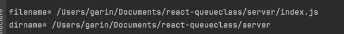

# Node 에서 module

> 모듈 ? 특정한 기능을 하는 함수나 변수들의 집합.   
노드는 코드를 모듈로 만들 수 있다는 점에서 브라우저의 자바스크립트와 다르다.     
그자체로 프로그램이자, 프로그램의 부품.

**variables.js**

```jsx
const odd = '홀수';
const even = '짝수';

module.exports= {
	odd, even
}; //  module 생략 가능하다. exports.a = aMethod;
```

외부에서 변수 사용 가능 해당 모듈의 odd, even을 import (require)

```js
import {odd, even} from "./variables.js";
console.log(odd); -> '홀수'
```

## exports

```jsx
module.exports.<함수이름> = () => {}
-> imports
```

## 노드 내장 객체 알아보기

### global

window와 같은 전역 객체, 모든 파일에서 접근 가능.

    window.open 메서드를 open으로 호출할 수 있는 것처럼 global

### console

- console.time : console.timeEnd와 대응 되어 같은 레이블을 가진 time 과 timeEnd 사이의 시간을 측정한다.
- console.log
- console.error
- console.table(배열) : 객체 리터럴을 넣을 시 객체의 속성들이 테이블 형식으로 표현됨.
- console.dir( 객체, 옵션) : 객체를 콘솔에 표시할 때 이용, 첫 번째 인수로 표시할 객체를 넣고, 두 번째 인수로 옵션을 넣는다.
- console.trace(레이블) 에러가 어디서 발생했는지 추적

### 타이머

타이머 기능을 제공하는 함수인 setTimeout, setInterval, setImmediate → window대신 global안에 잇음

- setTimeout(callback, miiliseconds) : 주어진 밀리초 이후에 콜백 함수 실행
- setInterval(callback, miiliseconds) : 주어진 밀리초마다 콜백 함수 반복 실행
- setImmediate(callback): 콜백함수 즉시 실행

이들 모두 아이디를 리턴해 아이디를 사용하여 타이머를 취소 가능

**example**

```jsx
const id = setTimeout(function(){
	console.log('hi');
}, 100)

clearTimeout(id);
```

### __filename, __dirname

경로에 대한 정보를 제공.

    파일 사이에 모듈 관계가 있는 경우가 많으므로 때로는 현재 파일의 경로나 파일명을 알아야함.



### module, exports, require

exports객체는 module.exports와 참조관계를 가진다.

    같은 객체를 참조하고 있기 때문에

module.exports == exports시 true

exports객체에 함수를 넣으면 module.exports와 같음

참조관계가 깨지지 않도록 주의해라.

**require객체는 모듈 관계를 만들어주고**

require를 콘솔에 확인시 전체 관계를 확인 가능. require.main →노드 실행시 첫 모듈

require.cache → 불러온 모듈 캐싱됨. 삭제 가능.

    ### process

현재 실행되고 있는 노드 프로세스에 대한 정보를 담고 있다 

→ process.version, process.arch, process.platform....

- process.env 시스템 환경 변수가 들어있고 임의로 넣어줄 수 있는데 오염되지 않도록 주의
- process.nextTick(callback) 이벤트 루프가 다른 콜백 함수들보다 nextTick의 콜백 함수를 우선으로 처리하도록 만듬.
- process.exit(code) :실행중인 노드 프로세스 종료. ㄹㄹㄹㄹㄹ