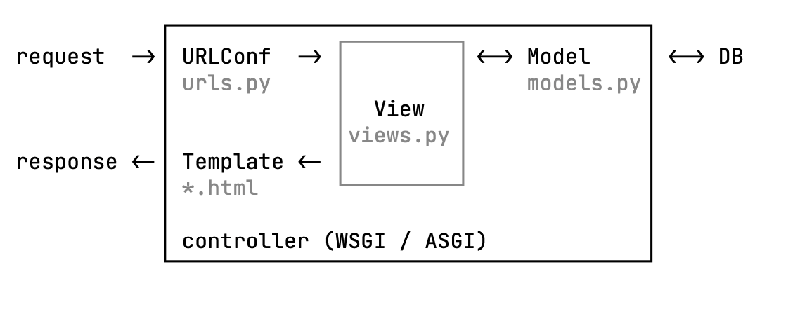

# [Django] - Setting, 기본 개념

## Django 특징

> Python Web Framework     
> MVT pattern ( Model-View-Template )     

> **Model** : 데이터 베이스에 연동 (orm)     
> **View** : 데이터 (를 가져오고 결과를 전달함) ( business logic )     
> **Template** : Data표현 , UI, ( presentation layer)     

Django Framework 자체를 controller라고 칭함     
     

## 기본 파일

### asgi

- Asynchronous Server Gateway Interface
- Web Server, Framework, WAS 의
동기/비동기 통신을 지원하는 python interface
- django 3.0 부터 지원

### settings

- application 환경 설정
- 주요 설정 DEBUG
  ALLOWED_HOSTS
  INSTALLED_APPS
  TEMPLATES
  DATABASES
  STATIC_URL

### urls

- urlpatterns 에 URL 정보를 등록해 view 와 연결     
- <변수명>, <type:변수명> 의 형태로 parameter 표현 가능     
- re_path() 함수를 통해 정규식 형태로 url pattern 표현 가능 re_path(r'^weblog/', include('blog.urls'))     

### views

- request 를 받아 화면을 구성하여 response     
- render(), redirect(), HttpResponse, JsonResponse 등을 return     
- 값을 template 에 전달하여 화면 구성 가능     
     
## 표현식
```python
{{변수명}}   
{{ iterable.index }}   
{{ object.key }}   
{{ value | filter }}     
```
----
## Setting

1. interpreter setting, 가상환경 세팅 후 장고 설치

```python
    pip install django
    pip install django-lint
```

2. start project

```python
    django-admin startproject <site name>
```

3. views세팅 (template X)

초기 세팅된 project 폴더 내부의 views
_나는 hello>hello>views.py_

```python
from django.http import HttpResponse

def index(request):
    return HttpResponse('<h1>hello world</h1>')
```

4. run server

./hello 에서

```python
    python manage.py runserver <port 변경시 localhost:8787과 같이 추가>
```

5. views 세팅

hello world 후에 hello 루트 안에서 urls.py 에
```python
from django.contrib import admin
from django.urls import path, include
from . import views

urlpatterns = [
    path('', views.index),
    path('admin/', admin.site.urls),
    path('hello01/', include('hello01.urls')),
    path('hello02/', include('hello02.urls')),
]
```

6. 하위 트리 구성 - (내부에 다른 프로젝트)


```python
(./hello 에서) python manage.py startapp hello01
```


_**hello 02-views**_

 ```python 
 from django.shortcuts import render

# Create your views here.
def hello(request) : 
    return render(request, 'hello02.html', {'name' : 'django'})
    
def variable01(request) : 
    lst = ['Python', 'Django']
    return render(request, 'variable01.html', {'lst' : lst})

def variable02(request) : 
    dct = {'class' : 'qclass', 'name' : '자기이름'}
    return render(request, 'variable02.html', {'dct':dct})

def for_loop(request):
    return render(request, 'for.html', {'numbers' : range(1,10)})

def if01(request) :
    return render(request, 'if01.html', {'user' : {'id' : 'qclass', 'name' : 'myname' }})

def if02(request) :
    return render(request, 'if02.html', {'role' : 'manager' })

def href(request) : 
    return render(request, 'href.html')
 ```


_**hello 02-urls**_

```python
urlpatterns = [
    path("", views.hello, name='index'),
    path("var01", views.variable01),
    path("var02", views.variable02),
    path("forloop", views.for_loop),
    path("if01", views.if01),
    path("if02", views.if02),
    path("href", views.href),
]
```


7. Tempate setting

_**hello>setting.py**_

```python
TEMPLATES = [
    {
        'BACKEND': 'django.template.backends.django.DjangoTemplates',
        **'DIRS': [BASE_DIR/'templates'], #어디로 갈지 여기서 설정할 수 있음**
        'APP_DIRS': True,
        'OPTIONS': {
            'context_processors': [
                'django.template.context_processors.debug',
                'django.template.context_processors.request',
                'django.contrib.auth.context_processors.auth',
                'django.contrib.messages.context_processors.messages',
            ],
        },
    },
]
```

8. 문법 예시

```html
    ============ if01
    
        <h1>Hello, {{user.name}}</h1>
    


    ============ if02
    
        <h1> admin page</h1>
    
        <h1>manager page</h1>
    
        <h1>user page</h1>
    
    

    ============ for

    
        <p>{{num}}</p>
    

    ============ variable1
    {{lst.0}}
    {{lst.1}}
    {{lst.2}}

    ============ variable2
     {{dct.class}}
    {{dct.name}}
```