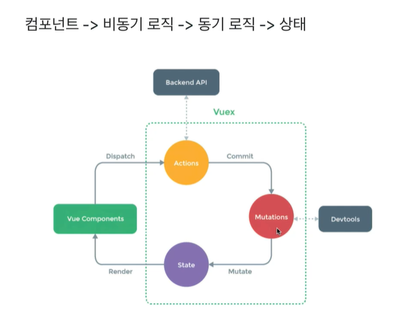

# Vuex

> Flux 패턴을 이용해 상태를 관리하기 위한 라이브러리 

- 복잡한 애플리케이션의 컴포넌트들을 효율적으로 관리
- Vuex로 프로젝트를 구조화하는 방법과 모듈화 방법 소개

## FLUX?

1. Action : 화면에서 발생하는 이베느 또는 사용자의 입력    
2. dispatcher : 데이터를 변경하는 방법, 메서드    
3. model : 화면에 표시할 데이터    
4. view : 사용자에게 비춰지는 화면      


   

## 설치

   `npm i vuex --save`
## 시작
   상태를 저장할 파일 하나를 생성한다.

    ```jsx
    import Vue from 'vue';
    import Vuex from 'vuex';

    Vue.use(Vuex); // 미들웨어식으로 처리함

    // Todo.vue
    export const store = new Vuex.Store({
        //

    });
    ```

   main.js

    ```jsx
    import Vue from 'vue';
    import App from './App.vue';
    import {store} from "./store";

    Vue.config.productionTip = false;

    new Vue({
        el: "#app",
        store,
        render: h => h(App),
    });
    ```

## 기술 요소

    - state : 여러 컴포넌트에 공유되는 데이터 data
    - getters  : 연산된 state값을 접근하는 속성 computed
    - mutations : state값을 변경하는 이벤트 로직, 메서드 methods
    - actions : 비동기 처리로직을 선언하는 메서드 async methods

 
### state, getters  

```javascript
    // store.js

    state : {todoItems : [...<todoItems>]},


    this.$store.state.todoItems //보이는 단에서는 이런 식으로 가져다 쓸 수 있다. 
    ==============================================================
    <transition-group name="list" tag="ul"> <!-- name에 쓰여진 것이 css 와 연관되는 부분이다. -->
        <li v-for="(todoItem) in this.$store.state.todoItems" v-bind:key="todoItem.id">
          <button @click="$emit('toggleComplete',todoItem)">toggle Todo</button>
          {{ todoItem.item }}
          <b>{{ todoItem.completed.toString() }}</b>
          <button v-on:click="remove(todoItem.id)">remove this</button>
        </li>
    </transition-group>

```

   ⇒ 이렇게 state값을 가져다 쓸 수 있다.

### mutations

- state값을 변경할 수 있는 유일한 방법이자 메서드
- 뮤테이션은 commit()으로 동작시킨다.

```javascript
    // store.js
    state : {num : 10},
    mutations : {
      printNumbers(state){ // 첫번째 인자로 스테이트 받음
          return state.num
      },
      sumNumbers(state, anotherNum){ 
          return state.num + anotherNum;
      }
    },

  // App.vue
  this.$store.commit("printNumbers");
  this.$store.commit("sumNumbers",20);
```

### actions

Mutations에는 순차적인 로직, 비동기는 x, 일반 함수   
actions에는 비동기 처리     
 dispatch를 이용하여 호출할 수 있다.    