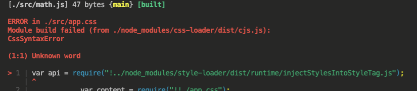
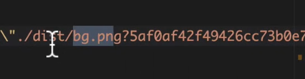

# 로더 (loader)

## 로더의 역할

웹팩은 모든 파일을 모듈로 바라본다.    
자바스크립트 뿐만 아니라 css, 글꼴까지도, 로더를 이용하면 모든 파일을 자바스크립트 파일로 만들어 준다.     
가령 예를 들면 이미지를 dataURL형식의 문자열로 변환한다. 뿐만 아니라 CSS 파일을 자바스크립트에서 직접 로딩할 수 있도록 해준다.     

### 커스텀 로더 만들기

webpack설정파일에 아래의 코드 추가

```jsx
module : { // 로더를 지정해 줄 떄엔 module 이란 값을 이요한다. 
        rules : [
            {
                test:/\.js$/, // 모든 js파일에 대해서
                use : [
                    path.resolve("./my-webpack-loader.js")//해당 로더를 이용할 것임을 명시
                ]
          }
    ]
}
```

*my-webpack-loader.js*

```jsx
module.exports = (content) => {
    console.log("loader동작");
    return content;
}
```

build명령 실행시 콘솔이 js의 개수만큼 찍히게 동작하게 된다.    

## Css-loader

웹팩은 모든 것을 모듈로 바라보기 때문에 자바스크립트 뿐만 아니라 스타일 시트로 import구문으로 불러 올 수 있다.     

```jsx
import "./style.css"
```

loader를 사용하면 이렇게 css를 모듈로 가져와서 쓸 수 있도록 해준다.     

1. npm i css-loader    
2. 설정파일에 css관련 설정을 추가한다.     

```jsx
module : {
    rules : [
        {
            test : /\.css$/,
            use : [
                "css-loader"
            ]
        }
    ]
}
```

이렇게 추가하면 모듈이 entry포인트부터 쭉 흝다가 css를 만나면 로더함수를 동작시켜준다     
로더가 css를 처리할 수 있도록 해준다.     
해당 파일을 빌드하게 되면 번들된 자바스크립트 코드 안에 cssOM으로 변환되어져 들어간다.    

*(html코드가 DOM으로 변환되듯이 CSS도 CSSOM이란 형태로 변환되어져 들어간다. )*

이걸 쓰려면 직접 불러오거나 인라인으로 넣어줘야하는데 그런처리는 안 된 상태    
그래서 style loader가 필요함    

```jsx
module : {
    rules : [
        {
            test : /\.css$/,
            use : [
                "style-loader", // 추가
                "css-loader",
            ]
        }
    ]
}
```

style loader가 css loader보다 먼저 들어가야 한다.     
loader는 오른쪽에서 왼쪽, 아래에서 위로 평가 및 실행되므로 아래 쪽에 css-loader로 코드를 변환, style-loader로 코드를 inject 이렇게 하지 않으면 module build failed 오류 발생한다     



## file-loader

css 뿐만 아니라 모든 파일을 모듈로 사용할 수 있게 끔 해주는 loader    
변환된 이미지 파일은 이름이 해싱이 되어있다.     

```jsx
{
    test : /\.png$/,
    loader : 'file-loader',
		options : {
        publicPath :"./dist/", // 파일로더가 사용하는 경로, 호출하는 쪽에서는 앞에 해당 단어를 붙이고 호출하게 될 것이다. 
        name : "[name].[ext]?[hash]",//캐시 무력화를 위해 물음표를 하고 달라지는 해시값을 입력하였다. 
     }
}
```



뒤에 해시 값이 빌드시마다 매번 달라져서 이미지 캐싱 문제를 해결할 수 있다.     

## url-loader

_사용하는 이미지 갯수가 많다면 네트웍 리소스를 이용하는 부담이 커진다._     
만약 한 페이지에서 작은 이미지 여러개를 사용한다면 Data URI Scheme을 이용하는 방법이 더 낫다.    
이미지를 Base64로 인코딩하여 문자열 형태로 소스코드에 넣는 형식이다.     
url-loader는 이러한 처리를 자동화해줌.    

```jsx
npm i -D url-loader
```

file loader를 url-loader로 변경.    
**리밋을 걸면 이 이상은 파일로더로 처리(불러옴), 아니면 url-loader로 처리 (코드로 복사됨)**    

```jsx
{
    test : /\.(png|jpg|gif|svg)$/,
    loader : 'url-loader',
    options : {
        publicPath:"./dist/", // 파일로더가 사용하는 경로, 호출하는 쪽에서는 앞에 해당 단어를 붙이고 호출하게 될 것이다. 
        name: "[name].[ext]?[hash]",//캐시 무력화를 위해 물음표를 하고 달라지는 해시값을 입력하였다.
        limit: 2000, // 2kb
    }
}
```

다양한 포맷의 이미지형식을 추가할 때는 이렇게    
-> _(png|jpg|gif|svg)_