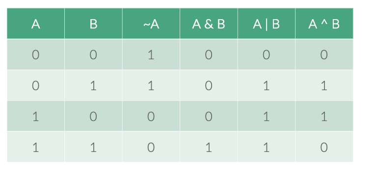
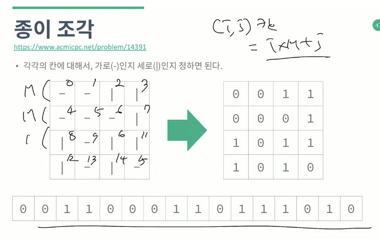

# # 브루트 포스 (BruteForce) - 비트마스크

& and ,| or , ~ not, ^ xor

 

추가 참고 자료 : [비트마스크 (BitMask) 알고리즘](https://rebro.kr/63)


## shift left 와 shift right 연산.

A << B A를 B 비트만큼 왼쪽으로 민다.  
A >> B A를 B비트만큼 오른쪽으로 민다.  
A << B 는 A * 2^B와 같다.   
A >> B는 A / 2^B와 같다.   

( A + B ) / 2 는 (A + B) >> 1로 쓸 수 있다.    
속도는 직접 계산하는 것보다 더 빠를수도 더 느릴 수도 있다.    
비트 연산에서 가장 중요한 것은 연산자 우선순위이다.    
괄호를 사용하도록 하자. 

1 << N - 1    
→ ( 1 << N ) - 1   
→ 1 << ( N - 1 )    

## 집합

하나의 비트가 하나의 원소를 의미하게 되는 것   

bit가 켜져있으면 해당 원소가 집합에 포함되어 있다는 의미이고, 꺼져 있으면 포함되어 있지 않다는 의미이다.   

N비트 정수 변수라면 N개의 원소를 갖는 집합의 부분 집합들을 모두 표현할 수 있게 된다.   
4 ⇒ [1,1,1,1]

원래는 N개의 boolean 원소를 갖는 배열을 선언해야 했지만, 비트마스크를 이용하면 정수 하나로 표현이 가능하기 떄문에 사용하는 메모리의 크기가 많이 줄어드는 장점이 있다.   

- **공집합과 꽉 찬 집합 구하기**   
`A = 0; / A = (1 << N) - 1`
- **원소 추가** 
`A |= (1 << k);`
- **원소 삭제** 
`A &= ~(1 << k);`
- **원소의 포함 여부 확인**
`if( A & (1 << k))`
- **원소 토글** 
`A |= (1 << k);`
- **두 집합에 대해서 연산**

    ```xml
    A | B    → A와 B의 합집합
    A & B    → A와 B의 교집합
    A & (~B) → A에서 B를 뺀 차집합
    A ^ B    → A와 B중 하나에만 포함된 원소들의 집합
    ```

- **집합의 크기 구하기**

    ```xml
    int bitCount(int A){
      if(A == 0) return 0;
      return A%2 + bitCount(A / 2);
    }

    [내장 명령어]
    gcc/g++ → __builtin_popcount(A) 
    visual C++ → __popcnt(A)
    Java → Integer.bitCount(A)
    ```

- **최소 원소 찾기** 
`int first = A & (-A);`
- **최소 원소 지우기**
`A &= (A - 1)`
- **모든 부분 집합 순회하기**
`for (int subset = A ; subset ; subset = ((subset - 1) & A)){ }`

## 부분집합의 합

서로 다른 N개의 정수로 이루어진 집합이 있을 떄 이 집합의 공집합이 아닌 부분집합 중에서 그 집합의 원소를 다 더한 값이  S가 되는 경우의 수를 구하는 문제   

모든 집합의 개수는 2^N   
모든 집합을 구해보면 된다.   
전체 집합은 ( 1 << N ) - 1    
공집합은 제외해야 하므로 1부터.   

```java
for (int i=1; i<(1<<n); i++) {
    int sum = 0;
    for (int k=0; k<n; k++) {
        if (i&(1<<k)) {
			sum += a[k];
		}
    }
    if (sum == s) {
		ans += 1; 
	}
}
```

## 스타트와 링크

비트가 0인 사람은 0번팀, 1인 사람은 1번 팀 이라고 하고 전체 경우의 수를 순회할 수 있다.   

## 종이조각

N×M 크기의 종이를 조각으로 잘라서 합의 최대 값을 구하는 문제 ( 1≤N, M≤4 )   
각각의 칸은 어찌됐든 가로 세로 둘 중 하나가 되게 되어 있고   
각각의 칸에 대해서, 가로인지 세로인지 정하면 된다.   
이렇게 하면 가로는 가로끼리, 세로는 세로끼리 더해주면 되는 것이다.   
2NM 으로 상태를 만들고나누어서 조사하여 다 더해야 한다.   

   

```java
import java.util.*;
public class Main {
    public static void main(String args[]) {
        Scanner sc = new Scanner(System.in);
        int n = sc.nextInt();
        int m = sc.nextInt();
        int[][] a = new int[n][m];
        for (int i=0; i<n; i++) {
            String s = sc.next();
            for (int j=0; j<m; j++) {
                a[i][j] = s.charAt(j)-'0';
            }
        }
        int ans = 0;
        // 0: -, 1 : |
        for (int s=0; s<(1<<(n*m)); s++) {
            int sum = 0;
            for (int i=0; i<n; i++) {
                int cur = 0;
                for (int j=0; j<m; j++) {
                    int k = i*m+j;
                    if ((s&(1<<k)) == 0) {
                        cur = cur * 10 + a[i][j];
                    } else {
                        sum += cur;
                        cur = 0;
                    }
                }
                sum += cur;
            }//  여기까지가 한 행에 대해서 조사하는 것이다. 

            for (int j=0; j<m; j++) {
                int cur = 0;
                for (int i=0; i<n; i++) {
                    int k = i*m+j;
                    if ((s&(1<<k)) != 0) {
                        cur = cur * 10 + a[i][j];
                    } else {
                        sum += cur;
                        cur = 0;
                    }
                }
                sum += cur;
            }
            ans = Math.max(ans,sum);
        }
        System.out.println(ans);
    }
}
```

