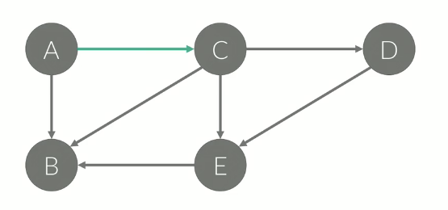
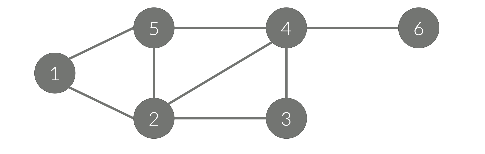
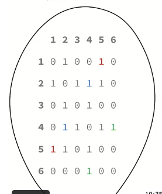
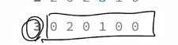
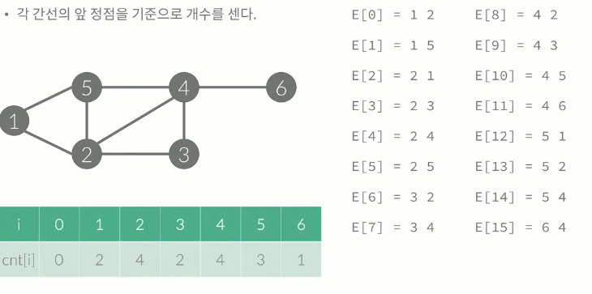

# 그래프 

브루트포스는 주어진 모든 경우의 수를 탐색한다는 의미    

>그래프의 경우는 문제에 주어진 상황을 **그래프로 모델링한다는 의미** → 이후에 알고리즘을 수행    
>어떻게 문제의 상황을 그래프로 만드는 지에 대한 것    

## 그래프?

>자료구조의 일종    

정점 (Node, Vertex) : 점    
간선 : 정점과 정점을 연결하는 선    

## 경로?

정점 A 에서 정점 B 로 가는 경로    

## 사이클

정점 A 에서 다시 A 로 **돌아오는** 경로    

## 단순 경로와 단순 사이클

경로 / 사이클 에서 같은  정점을 두 번 이상 방문하지 않는 경로 / 사이클    
특별한 말이 없으면, 일반적으로 사용하는 경로와 사이클은 단순 경로 / 사이클을 말한다.     
방향이 있을 수도, 없을 수도 있다.    

## 방향이 있는 그래프

   

표기된 방향으로만 갈 수 있다. 

## 방향이 없는 그래프

양방향 그래프라고도 함. (Bidirection Graph)    

## 간선

두 정점 사이에 간선이 여러 개일 수도 있다.    

## 루프

간선이 양 끝점이 같은 경우    

## 가중치

간선에 써있는 어떤 값    
여러가지 값을 가질 수 있다.     

## 차수 (Degree)

정점과 연결되어 있는 간선의 개수    

## 그래프의 표현

아래의 그래프를 정점과 간선으로 표현은 이렇게 한다.    

정점 : {1,2,3,4,5,6}    
간선 : {(1,2),(1,5),(2,5),(2,3),(3,4),(2,4),(4,5),(4,6)}    

   

## 그래프 저장 방법

하나의 일차원 배열에 쭉 저장하는 것도 가능하지만 효율적인 문제가 생기는데    
한 정점 x의 연결된 간선을 효율적으로 찾는 구조를 만드는 것이 그래프를 만드는 이유이기 때문에 이것에 집중해야 한다.     

***1) 인접 행렬***    
***2) 인접 리스트***    

### 인접행렬

정점의 개수를 V라고 했을 때 V * V크기의 이차원 배열을 이용한다.     
A[i][j] = 1 ( i→j 간선이 있을 때), 0 (없을 때)     

   

하나의 정점과 관련된 모든 경우의 수는 이런 식으로 찾을 수 있다. ⬇️    

   

### 인접리스트

링크드 리스트를 이용해서 구현한다.  크기를 동적으로 변경할 수 있어야 한다.     
C++ Vector, Java ArrayList, Python 원래 동적으로 사용이 가능    


- A[i] = i 와 연결된 정점을 리스트로 포함.    

A[1] = [2, 5]    
A[2] = [1,3,4,5]    
A[3] = [2,4]    
A[4] = [3, 5, 2]    
A[5] = [1, 2, 4]     
A[6] = [4]    

- 가중치가 있는 경우 가중치를 함께 저장

A[1] = [(2,2),(5,7)]    
A[2] = [(1,2), (3,2), (4,3), (5,1)]    

### 공간 복잡도

인접 행렬 :  O(V^2)    
인접 리스트 : O(E) → 차수의 개수    

### 간선 리스트

→ 인접 리스트를 사용해야 하는데 라이브러리는 싫고 링크드리스트도 구현하기 싫은 사람들..    

- 배열을 이용해서 구현한다    
- 간선을 모두 저장하고 있다. E라는 배열에 간선을 모두 저장    
- 각 간선의 앞 정점을 기준으로 개수를 셈    

```cpp
for (int i=0; i<m; i++){
	cnt[e[i][0]] += 1;
}
```

   

## 문제

### ABCDE

[13023번: ABCDE](https://www.acmicpc.net/problem/13023)

```cpp
#include <iostream>
#include <vector>
#include <algorithm>
using namespace std;
bool a[2000][2000]; // 인접행렬
vector<int> g[2000]; // 인접리스트
vector<pair<int,int>> edges; // 간선리스트 
int main() {
    int n, m;
    cin >> n >> m;
    for (int i=0; i<m; i++) {
        int from, to;
        cin >> from >> to;
        edges.push_back({from, to});
        edges.push_back({to, from});
				// ====  간선 리스트에 넣어주기
        a[from][to] = a[to][from] = true; // 인접 행렬에 세팅
        g[from].push_back(to); // 인접리스트에 세팅
        g[to].push_back(from);

    }
    m *= 2;
    for (int i=0; i<m; i++) {
        for (int j=0; j<m; j++) {

					//======== 간선 리스트에서 해당하는 값이 있는 지 없는 지 찾는 방법
            // A -> B
            int A = edges[i].first;
            int B = edges[i].second;
            // C -> D
            int C = edges[j].first;
            int D = edges[j].second;
            if (A == B || A == C || A == D || B == C || B == D || C == D) {
                continue;
            }

						//======= 인접 행렬에서 값을 찾는 방법
            // B -> C
            if (!a[B][C]) {
                continue;
            }
            // D -> E
            for (int E : g[D]) {
                if (A == E || B == E || C == E || D == E) {
                    continue;
                }
                cout << 1 << '\n';
                return 0;
            }
        }
    }
    cout << 0 << '\n';
    return 0;
}
```

## 그래프의 탐색

DFS, BFS    

_그래프 탐색의 목적? 임의의 정점에서 시작, 연결되어 있는 모든 정점을 한 번 씩 방문하는 것_    

 ***DFS, BFS의 차이는 각 정점을 어떤 순서로 정점을 방문할 것이냐에 있다.***     

>**DFS : 깊이 우선 탐색: Stack**    
**BFS : 너비 우선 탐색 : Queue**    

DFS는 한 번 갔던 곳은 가지않는 다는 가정하에 탐색     
BFS는 1-5, 1-2, 1-5-4, 1-2-3 이런 식으로 복제되는 느낌으로 탐색이 된다.     

## 깊이 우선 탐색 (Depth First Search )

- **스택**을 이용해서 갈 수 있는 만큼 최대한 많이 가고    
- 갈 수 없으면 이전 정점으로 돌아간다.    

정점을 인덱스로 가지는 배열, 정점을 이미 갔었는지 기록하는 배열 check를 가지게 해주며 값을 스택에 담아준다.     
재귀 호출을 이용해서 구현할 수 있다. (인접 행렬을 이용)    

```cpp
void dfs(int x){
	check[x] = true;
	for(int i = 1; i<=n; i++){
		if(a[x][i] == 1 && check[i] == false){
			dfs(i);
		}
	}
}
```

인접 리스트를 이용하여 구현

```cpp
void dfs(int x){
	check[x] = true;
	for(int i=0; i<a[x].size(); i++){
		int y = a[x][i];
		if(check[y] == false){
			dfs(y);
		}
	}
}
```

## 너비 우선 탐색 (중요)(Breadth First Search)

- **큐**를 이용해서 가야할 것들을 관리하는 방식    
- 큐를 이용해서 지금 위치에서 갈 수 있는 것을 모두 큐에 넣는 방식    
- 큐에 넣을 때 방문했다고 체크해야 한다.    

```cpp
queue<int> q;
check[1] = true; q.push(1);
while(!q.empty()){
	int x = q.front().pop(); //시작된 값
	for( int i=1; i<=n; i++){
		if(a[x][i] == 1 && check[i] == false){
			check[i] = true;
			q.push(i);
		}
	}
}
```

인접 리스트 사용    

```cpp
queue<int> q;
check[1] = true; q.push(1);
while (!q.empty()) {
   int x = q.front(); q.pop();
   for (int i=0; i<a[x].size(); i++) {
     int y = a[x][i];
     if (check[y] == false) {
        check[y] = true; q.push(y);
		 }
	} 
}
```