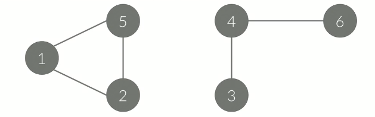
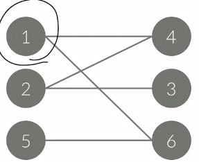
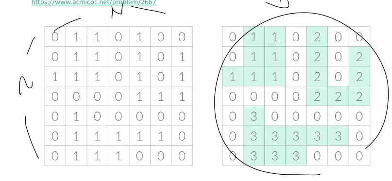

## 연결요소

그래프가 아래 그림과 같이 나누어져 있지 않은 경우가 있을 수도 있다.    
>이렇게 나누어진 각각의 그래프를 연결 요소라고 한다.     
연결 요소에 속한 모든 정점을 연결하는 경로가 있으면 안된다.     



한 그래프가 연결요소가 몇 개인지 알아보는 건 DFS, BFS를 이용하면 됨    
두 알고리즘이 하나의 시작점에서 연결되어있는 모든 정점을 방문하는 것이기 떄문이다.     

## 이분 그래프

그래프가 두 개로 나누어져 있는 것     

- A에 포함되어 있는 정점끼리 연결된 간선이 없음    
- B에 포함되어 있는 정점끼리 연결된 간선이 없음    
- 모든 간선의 한 끝 점은 A에, 다른 끝 점은 B에    



그래프가 이분 그래프 이면 YES, 아니면 NO 를 순서대로 출력한다.    

```cpp
vector<int> a[20001];
int color[200010]; // check 0:방문안함 1: 방문했는데 그룹번호1 2:방문했는데 그룹번호2
void dfs(int node, int c){ // c는 그룹 번호 A에 속하는 지, B에 속하는 지 
	color[node] = c;//node의 방문 여부를 체크 해줌
	for( int i=0; i<a[node].size(); i++){ // 해당 노드의 요소들을 탐색하기
		int next = a[node][i]; // 해당 노드와 연결된 다른 노드를 칭함
		if(color[next] == 0){ // 아직 체크를 안했다면
			dfs(next, 3-c); //  1->2 2->1 으로 탐색하게 해준다. 
		}
	}
}
```

## 문제풀이

### 미로탐색

- (1,1) 에서 (N,M) 으로 가는 가장 빠른 길을 구하는 문제    
- DFS 탐색으로는 문제를 풀 수 없다.    
- BFS 탐색을 사용해야 한다.    
- BFS 는 단계 별로 진행된다는 사실을 이용    




### 토마토

- 하루가 지나면, 익은 토마토의 인접한 곳에 있는 익지 않은 토마토들이 익게 된다.    
- 인접한 곳 : 앞, 뒤, 왼쪽, 오른쪽    
- 토마토가 저절로 익는 경우는 없다.    
- 상자안의 익은 토마토와 익지 않은 토마토가 주어졌을 때, 며칠이 지나면 토마토가 모두 익는지 구하는 문제    
- BFS 탐색을 하면서, 거리를 재는 방식으로 진행한다.    