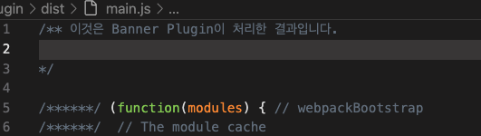

## 플러그인의 역할

>로더는 각 파일을 처리했던 것에 비해서 플러그인은 번들된 파일을 처리한다.    
번들된 자바스크립트를 난독화 한다거나 특정 텍스트를 추출하는 용도로 사용한다.    

## 기본 설정 파일

```jsx
plugins : [
   new MyWebpackPlugin()
]
```

## plugin 만들기

```jsx
class MyWebpackPlugin {
    // apply (compiler){
    //     compiler.hooks.done.tap('My Plogin', stats => {
    //         console.log("My Plugin : done");
    //     });
    // }
   apply(compiler) {
        compiler.plugin("emit", (compilation, callback) => {
            const source = compilation.assets['main.js'].source(); // 
            console.log(source);
            callback();
        });
        
    }
}

module.exports = MyWebpackPlugin;
```

위에서는 compilation.assets['main.js']와 같은 코드로 해당 파일의 소스에 접근할 수 있고     
빌드시 콘솔에 결과물이 찍히는 것을 볼 수 있다.     

compilation이란 객체로 웹팩이 번들링 된 파일에 접근할 수 있음을 알 수 있다.     


- **번들링 된 파일에 문자열 추가하기**    

```jsx
class MyWebpackPlugin {
    // apply (compiler){
    //     compiler.hooks.done.tap('My Plogin', stats => {
    //         console.log("My Plugin : done");
    //     });
    // }
    apply(compiler) {
        compiler.plugin("emit", (compilation, callback) => {
            const source = compilation.assets['main.js'].source();

            compilation.assets['main.js'].source = () => {
                const banner = "/** 이것은 Banner Plugin이 처리한 결과입니다. \n\n*/";
                return banner + "\n\n" + source;
            }
            console.log(source);
            callback();
        });
    }
}

module.exports = MyWebpackPlugin;
```

**소스파일에 코드를 좀 더 추가할 수 있다.**    
번들링 된 파일에서 확인할 수 있었다.    



## 자주 사용하는 플러그인

개발하면서 플러그인을 직접 작성할 일은 거의 없다. 자주 사용하는 만들어진 플러그인과 서드파티 플러그인은 아래와 같다.    

### BannerPlugin

**기본적으로 웹팩이 제공하는 플러그인. 결과물에 빌드 정보나 커밋 버전같은 걸 추가할 수 있다.** 

- webpack.config.js

```jsx
...
const webpack = require("webpack");
const childProcess = require("child_process"); // 노드의 명령어에 접근할 수 있다.

module.exports = {
	...
	plugins : [
		new webpack.BannerPlugin({
            banner : `
                Build Date : ${new Date().toLocaleString()}
                commit version : ${childProcess.execSync('git rev-parse --short HEAD')}
            `
    })
	]
}
```

### DefinePlugin

어플리케이션은 개발환경과 운영환경으로 나눠서 운영한다.    
가령 환경에 따라 API서버 주소가 다를 수 있다.   
같은 소스 코드를 두 환경에 배하기 위해서는 이러한 환경의존적인 정보를 소스가 아닌 곳에서 관리한느 것이 좋다.   

**웹팩은 이러한 환경 정보를 제공하기 위해 DefinePlugin을 제공**한다. 

```jsx
plugins : [
		...
		new webpack.DefinePlugin({})
	]
```

빈 객체를 전달해도 기본적으로 넣어주는 값이 있다.    
process.env.NODE_ENV인데 웹팩 설정의 mode에 설정한 값이 여기에 들어간다. *(mode : "development")*   

development를 설정했기 떄문에 어플케이션 코드에서 process.env.NODE_ENV 변수로 접근하면 development 값을 얻을 수 있다.    

`console.log(process.env.NODE_ENV);`   

와 같은 것을 가능하게 해준다.    

```jsx
new webpack.DefinePlugin({
	TWO : "1+1" // 문자열로 접근할 시 JSON.Stringify로 접근하기 
	api.domain : 
})
```

위와 같이 직접 설정을 할 수도 있다. console.log(TWO)로 접근 가능.    

### HtmlTemplatePlugin

 HTML 처리시에 사용한다.     

**직접 우리가 아웃풋을 넣어주는 정적 html 파일을 만드는 것이 아닌 이 조차도 직접 만들어 주는 plugin**   

```jsx
...
plugins:[
		new HtmlWebpackPlugin({
       template : "./src/index.html" 
   })
]
```

위와 같이 경로를 지정할 수 있다.     

development라는 변수를 직접 가지고오고 싶을 수도 있다.     

```jsx
templateParameters :{
    env : process.enb.NODE_ENV === "development" ? "dev" : "prod"
}
```

index.html에서     

`<title><%= env%></title>`    

와 같이 가지고 올 수 있다.     

코드 경량화 옵션을 줄 수도 있다.    

```jsx
minify : process.env.NODE_ENV === 'production' ? {
      collapseWhitespace : true,
      removeComments : true
}: false
```

### CleanWebpackPlugin

CleanWebpackPlugin은 **빌드 이전 결과물을 제거하는 플러그인**이다.     

빌드 결과물은 아웃풋 경로에 모이는데 과거 파일이 남아있을 수 있다. 이전 빌드 내용이 덮어 씌여지면 상관없지만 그렇지 않으면 아웃풋 폴더에 여전히 남아 있을 수 있다.     

임시로 아웃풋 폴더에 foo.js 파일을 만든 후 다시 빌드해 보자.... 파일이 남아있다.     

npm i clean-webpack-plugin을 이용해서 추가 가능    

빌드시에 foo.js가 사라짐을 확인할 수 있다.     

```jsx
const {CleanWebpackPlugin} = require("clean-webpack-plugin"); // 불러올 때 디폴트로 설정되어있지ㅣ 않아서 이런 식으로 가져옴
```

### MiniCssExractPlugin

스타일 시트가 점점 많아지면 하나의 자바스크립트 결과물로 만드는 것이 부담일 수 있다.     

**번들 결과에서 스타일시트 코드만 뽑아서 별도의 CSS파일로 만들어 역할에 따라 파일을 분리하는 것이 좋다.**    
**브라우저에서 큰 파일 하나를 내려받는 것보다, 여러 개의 작은 파일을 동시에 다운로드 하는 것이 더 빠르다.**    

개발 환경에서는 CSS를 하나의 모듈로 처리해도 상관없지만 운영 환경에서는 분리하는 것이 효과적

```jsx
npm i -D mini-css-extract-plugin
```

아래와 같이 등록할 수 있으며

```jsx
const MiniCssExtractPlugin = require("mini-css-extract-plugin");

...
plugins : [
	...
	(
        mode === 'production' ?
        new MiniCssExtractPlugin({filename:'[name].css'})
    : [])
]
```

cssloader의 설정도 변경해주어야 한다. 

```jsx
module : {
	rules : [
		...
        {
            test : /\.css$/,
            use : [
                mode === 'production' ? MiniCssExtractPlugin.loader 
                : "style-loader",
                "css-loader"
            ]
        },
	]
}
```