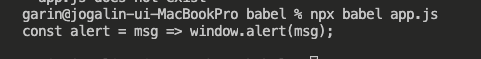
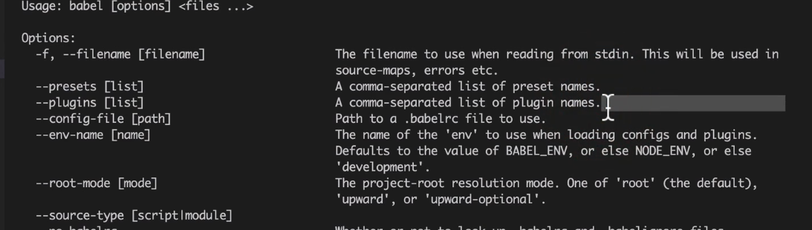

# Babel

## 왜? 크로스브라우징을 위해.

>브라우저에서는 사용하는 자바스크립트에서 사용하는 언어가 조금씩 다르고 지원하는 스펙이 다르다.    
이것을 맞춰주는 것이 바벨    

## 바벨의 기본 동작

ECMAScript2015 이상의 코드를 적당한 하위 버전으로 바꿔줌.     
어떤 브라우저에서도 환경에 맞추어 자바스크립트가 동작할 수 있도록 해준다.    

## 사용

```jsx
npm install -D @babel/core @babel/cli
```

```jsx
const alert = msg => window.alert(msg);
```

babel/core : 코드를 변환시켜주고 객제의 콜백을 콜 해줌. 근데 구문 분석이나 기본적인 문법 변환 등만 함.   
babel/cli : 터미널로 사용하기 위한 것     

실행을 위해선 node_modules/.bin 폴더에 추가된 바벨 명령어를 사용할 수 있다.     

또는     

`npx babel app.js`

을 실행한다.     

바벨은 세 단계로 빌드를 진행한다.    

1. **파싱(Parsing)**
2. **변환(Transforming)**
3. **출력(Printing)**

코드를 읽고 추상 구문 트리로 변환하는 단계를 **"파싱"**이라고 한다. 이것은 빌드 작업을 처리하기헤 적합한 자료구조인데 컴파일러 이론에 사용되는 개념이다.     

추상 구문 트리를 변경하는 것이 **"변환"** : es6 → es8로...    
(아직까진 변환이 되진 않았다. 여전히 콘솔엔 const가 존재함)    

    

변경된 결과물을 **"출력"**하는 것을 마지막으로 바벨은 작업을 완료한다.    

## 플러그인

바벨은 파싱과 출력만 담당하고 변환작업은 플러그인이 한다.     

직접 플러그인을 만들어 볼 수 있다.     

- **my-babel-plugin.js**

```jsx
module.exports = () => {
    return {
        visitor : {
            Identifier = (path) => {
                const name = path.node.name;

                console.log("Identifier() : ", name);
                // 변환작업 : 코드 문자열을 역순으로 변환한다. 
                // path.node.name = name
                //   .split("")
                //   .reverse()
                //   .join("")
                /**
                 * 현재는 지금 변환작업은 아무것도 하지 않고 콘솔만 출력@@@
                 * 
                 * 
                 * 
                 */
            }
        }
    }
}
```

babel help 문서를 본다.    

`npx babel —help`    

`--plugins [list]`   를 통해서 리스트에 플러그인 이름을 추가할 수 있음을 알 수 있다.     


`npx babel app.js --plugins './my-babel-plugin.js'`

를 이용해 만든 바벨 플러그인을 실행시켜보도록 하면 콘솔에는     

```jsx
Identifier() :  alert
Identifier() :  msg
Identifier() :  window
Identifier() :  alert
Identifier() :  msg
const alert = msg => window.alert(msg);
```

이렇게 출력이 되는데,    

코드 문자열을 역순으로 변환하는 코드주석을 해제하고 다시 실행시에는    

```jsx
const trela = gsm => wodniw.trela(gsm);   
```

콘솔에 출력되는 구문은 같지만 뒤집어 졌다.     

그럼 const 를 var로 바꿔보자    

```jsx
VariableDeclaration(path){
                console.log(path.node.kind);

                if(path.node.kind === "const"){
                    path.node.kind = 'var';
                }
            }
```

## 플러그인 사용하기

이러한 결과를 만드는 것이 ***block-scoping*** 플러그인    

const, let 처럼 블록스코핑을 따르는 예약어를 함수 스코핑을 사용하는 var로 변경한다.     

_install_

```jsx
npm install --save-dev @babel/plugin-transform-block-scoping
```

화살표 함수 의 변환 같은 경우는 ***arrow-functions 플러그인***을 이용    

→ @babel/preset-env 에 내장됨     

또한 ECMAScript5에서부터 지원하는 엄격 모드를 사용하는 것이 안전하므로 **"use strict"구문을 추가하기 위해선 strict-mode 플러그인을 이용**한다.     

```jsx
npx babel app.js --plugins @babel/plugin-transform-block-scoping ......
```

이러한 모듈들을 하나씩 추가하다보면 명령어가 길어지기 때문에 cli실행을 하지 않고 설정파일을 이용한다.     

- **babel.config.js**

```jsx
module.exports = {
    plugins : [
        "@babel/plugin-transform-arrow-functions",
        "@babel/plugin-transform-block-scoping",
        "@babel/plugin-transform-strict-mode",
    ]
}
```

이런식으로 플러그인을 모두 작성하는 것은 비현실적    
이런 것을 해결해주는 것이 프리셋이다    

## 프리셋 사용하기

바벨은 목적에 따라 몇 가지 프리셋을 사용한다.    

- preset-env    
- preset-flow    
- preset-react    
- preset-typescript    

IE 지원을 해주는 가장 많이 쓰이는 프리셋인 preset-env를 설치하기    

`npm i @babel/preset-env`    

- **babel.config.js**    

```jsx
module.exports = {
   presets : [
       "@babel/preset-env"
   ]
}
```

## 타겟 브라우저    

타켓 옵션에 브라우저 버전 명을 명시하면 해당하는 브라우저만 지원할 수 있도록 설정할 수 있다.     

```jsx
...
"@babel/preset-env", {
    targets : {
         chrome : "79"
    }
}
```

## 프라미스 함수의 변환

변환을 했음에도 불구하고 promise함수는 ie11에서 해석되지 못하고 에러를 던짐    
이유는 ECMA2015+를 ECMAScript5버전으로 변환할 수 있는 것만 빌드한다.     
그렇지 못한 것들은 폴리필이라고 부르는 코드 조각을 추가해서 해결한다.    
예를 들면 ECMA2015의 블록 스코핑은  ECMAScript5 의 함수 스코핑으로 대체가 가능하다.     

프라미스는 불가능하지만, ECMAScript5 버전으로 구현할 수는 있다.    

env 프리셋을 이용해 폴리필을 지정할 수 있는 옵션을 지정할 수 있다.     

```jsx
...
useBuiltIns : "usage", // 폴리필 사용 방식 지정
corejs : {
    version : 2 // 폴리필 버전 지정
},
```

## 웹팩으로 통합하기

실무환경에서는 바벨을 직접 사용하지 않고 웹팩으로 통합해서 사용하는 것이 일반적이다.     

```jsx
npm i -D babel-loader
```

- webpack.config.js

```jsx
// webpack.config.js:
module.exports = {
  module: {
    rules: [
      {
        test: /\.js$/,
        exclude: /node_modules/,
        loader: "babel-loader", // 바벨 로더를 추가한다
      },
    ],
  },
}
```

.js로 끝나는 파일은 babel-loader가 처리할 수 있다.     

폴리필 사용 설정을 했다면 core-js도 설치해야한다. 웹팩은 바벨 로더가 만든 코드를 만나면 core-js를 찾기 때문..    

```jsx
npm i core-js@2
```