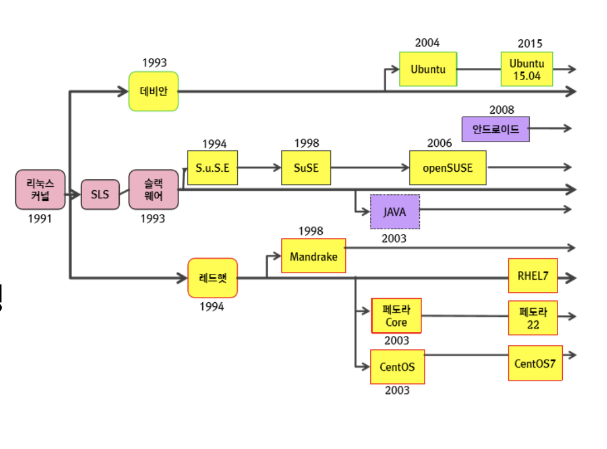
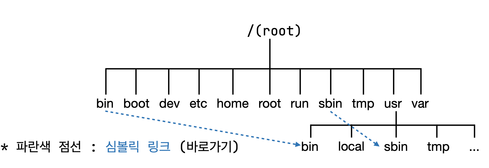
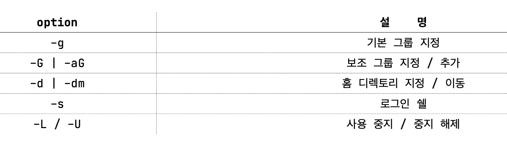

# Linux

## Linux?

핀란드 헬싱키 대학교의 학생이었던 리누스 토발즈가 처음 개발

MINIX를 참조



- RedHat  
  → RHEL : 유료     
  → CentOS : RHEL을 무료로     
  → Fedora : 빠른 업데이트, 낮은 안정성    

- Debian 계열  
  → Devian : server, embeded에 주로 사용    
  → Ubuntu : Debian에 편의성 추가    

- SuSE  
  Suse : 유럽에서 많이 사용    

- POSIZ ( Portable Operating System Interface ) : OS표준    
- LSB ( Linux Standard Bse ) : Linux 표준    
- POSIX 표준에 맞추고, 일부 확장     
- file system 계층 등의 구조를 표준화     

## file system

: 단일 디렉토리 트리로 구성



- /bin : binary (실행파일 등)
- /sbin : system (or superuser) binary (관리자를 위한 실행파일 등)
- /boot : booting과 관련된 파일 (bootloader, 커널 등)
- /dev : device. 각종 장치 파일 등 (cd rom 등"..)
- /etc : 주요 설정. 시스템 환경 설정 등 (ex. /etc/hosts = dns 역할)
- /home : 개인 사용자 디렉토리
- /root : 관리자의 home 디렉토리
- /run : 실행 정보 파일
- /tmp : temporary. 임시 파일 (잠시 만들어지고 사라지는 파일들)
- /usr : 작은 root (/usr/local = 일반적인 오픈소스 기본 설치 디렉토리)
- /var : variable (log파일 등)

## 사용자 관리

비밀번호가 없는 사용자는 사용 불가  
superuser로 로그인 하는 것은 지양  
/etc/sudoers 파일을 이용하여 특정 사용자에게 관리 명령 부여 가능  
/var/log/secure 파일에 sudo 명령 logging  
한 사용자가 여러 개의 그룹에 포함 가능

```html
su [사용자명] (switch user) : 해당 사용자로 변경(관리자의 비밀번호 필요)    
sudo [명령어] (superuser do): 관리자 권한으로 실행 관리자가 sudo 사용하도록 허용해야 함    
id [사용자명] : 사용자 정보 확인     
passwd [사용자명] : 사용자 비밀번호 설정     
useradd [사용자명] : 사용자 생성     
usermod [option] [사용자명] : 사용자 정보 수정    
userdel [-r] [사용자명] : 사용자 삭제    
```



## file

### 파일 권한 관리

**d : directory  
r : read  
w : write  
x : execute**

ex) drwxr-xr"- : directory이고,  
해당 파일을 생성한 사용자는 모든 권한을,  
생성자와 같은 그룹의 사용자는 읽기와 실행 권한을, 타그룹 사용자는 읽기 권한을 가진다.

**chmod [option] [filename]**  
-숫자로 한번에 추가/삭제가능

```html
ex) chmod 777 test1 : -rwxrwxrwx chmod 700 test1 : -rwx------ chmod 755 test1 :
-rwxr-xr-x
```

**chown [옵션] [owner][:group] [파일명]**

```html
cp file1 file2 : file 복사 
mv file1 file2 : file 이동 (변경) 
rm file1 : file 삭제 
mkdir dir1 : 디렉토리 생성 
cp -r dir1 dir2 : 디렉토리 복사 
mv dir1 dir2 : 디렉토리 이동(변경) 
rm -r dir1 : 디렉토리 삭제 같은 디렉토리에서 할 시에 변경이 된다. 
rm file1 : file 삭제 
kdir dir1 : 디렉토리 생성 
cp -r dir1 dir2 : 디렉토리 복사 
mv dir1 dir2 : 디렉토리 이동(변경) 
rm -r dir1 : 디렉토리 삭제
```

### 그 밖의 옵션

```html
cp file1 file2 : file 복사 
mv file1 file2 : file 이동 ( 변경 )
```

## package 관련

**RPM : Redhat Package Manager**

: \*.rpm     

: windows의 setup과 비슷한 역할    

```html
rpm -i[옵션] rpm-package : rpm-package 설치 
rpm -u[옵션] rpm-package : rpm-package 업그레이드
```

**YUM : Yellowdog Updater Modified**

: rpm : 기반의 package tool     
: 패키지를 분석하여 의존성 해결 ( 자동 설치)      
: /etc/yum.repos.d 에 패키지 저장소 파일 저장      

```html
yum [-y] install package-name package 설치   

package 업데이트      

yum update package-name     
yum upgrade package-name     

package 삭제
yum [-y] erase package-name 
yum [-y] remove package-name 

package 정보 확인
yum info package-name  
```

## text editor

vi : VIsual display editor
- 가벼운 text editor

vim : VI iMproved
- vi호환 text editor
- cui 용 뿐만 아니라 gui도 있음 (대부분 cui사용)
- vim script : vim에 통합된 스크립트형 언어

## achive

- **tar** : 속도 빠름/ 압축률 낮음 / 확장자 .tar 
- **gzip** : 속도 보통/ 압축률 보통 / 확장자 .gz 
- **bzip** : 속도 느림/ 압축률 느림 / 확장자 .bz2 

gzip은 여러 개의 파일을 압축하지 못함 -> 일반적으로 tar와 같이 사용

기본 형태
**tar [옵션] [파일명]**
c : tar 압축
x : tar 압축 해제
f : 여러 개의 파일
v : 처리 정보 출력

z : gzip 사용
j : bzip2 사용

## 추가

cat[파일명] : 파일 내용 보기    
명령 | 명령 : 명령의 결과를 다른 명령의 입력으로 사용     
명령 < 파일명 : 파일로부터 입력 (키보드 입력 대신)    
명령 > 파일명 : 파일로 새로 저장 (모니터 대신)    
명령 >> 파일명 : 파일로 추가 저장     

프로세스중인 서버 포트 확인    
sudo lsof -i:포트번호    

위에서 프로세스아이디 확인 후 서버 킬    
kill -9 {PID}      